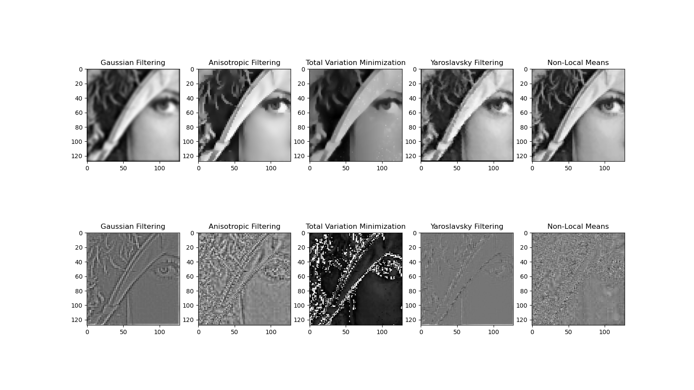

# Non-Local Means Algorithm

 

实现了5种图像去噪算法：

`Gaussian Filter` `Anisotropic Filter` `Total Variation Minimization` `Yaroslavsky Filter` `Non-Local Means`

需要去噪的图片路径在`NLM.__init__下的 self.img_path = "noisy_image2.jpg"`中进行设置

最后的对比图的图片路径在`__main__`下的`    save_path = "./Result.png"`中进行设置

直接运行`NLM.py`即可得到如下对比图

5种去噪函数的参数如下：

==1.==`Gaussian_Filtering(self, src, dst = [], kernel_size = 3, sigma=0.8):`

`src`为`numpy`数组输入的图像, `dst`为去噪后结果图像，`kernel_size`为高斯核大小, `sigma`为高斯函数的`sigma`

==2.==`Anisotropic_Filtering(self, src, dst=[], iterations = 10, k = 15, _lambda = 0.25):`

公式如下：
$$
I_{t+1} = I_t+\lambda (cN_{x,y}\nabla_N(I_t)+cS_{x,y}\nabla_S(I_t)+cE_{x,y}\nabla_E(I_t)+cW_{x,y}\nabla_W(I_t))
$$

$$
\nabla_N(I_{x,y})=I_{x,y-1}-I_{x,y}\\
\nabla_S(I_{x,y})=I_{x,y+1}-I_{x,y}\\
\nabla_E(I_{x,y})=I_{x-1,y}-I_{x,y}\\
\nabla_W(I_{x,y})=I_{x+1,y}-I_{x,y}\\
$$

$$
cN_{x,y} = exp(-\Vert\nabla_N(I)\Vert^2/k^2)\\
cS_{x,y} = exp(-\Vert\nabla_S(I)\Vert^2/k^2)\\
cE_{x,y} = exp(-\Vert\nabla_E(I)\Vert^2/k^2)\\
cW_{x,y} = exp(-\Vert\nabla_W(I)\Vert^2/k^2)\\
$$

`src`为`numpy`数组输入的图像, `dst`为去噪后结果图像,`iterations`为迭代次数,`k`是导热系数相关的常数

==3.==`Total_Variation_Minimization(self, src, dst=[], iterations = 100, _lambda = 0.03):`

`src`为`numpy`数组输入的图像, `dst`为去噪后结果图像,`iterations`为迭代次数,`_lambda`是常数

==4.==`Yaroslavsky_Filtering(self,src,dst=[],kernel_size=3,h=1)`

`src`为`numpy`数组输入的图像, `dst`为去噪后结果图像,`kernel_size`为卷积核大小,`h`是常数

==5.==`def NLMeans(self, src, dst=[], t=10, f=3, h=1):`

`src`为`numpy`数组输入的图像, `dst`为去噪后结果图像,`t`是搜索窗口大小,`f`是相似窗口大小,`h`是常数

公式为：
$$
NL[v](i) = \sum_{j\in I}w(i,j)v(j)\\
w(i,j)=\frac{1}{Z(i)}e^{-\frac{\Vert v(N_{i})-v(N_j)\Vert^2_{2,a}}{h^2}}\\
Z(i)=\sum_j e^{-\frac{\Vert v(N_{i})-v(N_i)\Vert^2_{2,a}}{h^2}}
$$
每个函数的返回值都是`dst, method_noise` 。`dst`为去噪结果, `method_noise`为`src-dst`

